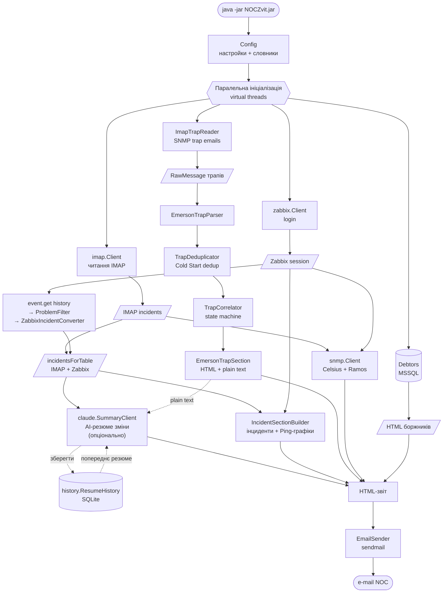
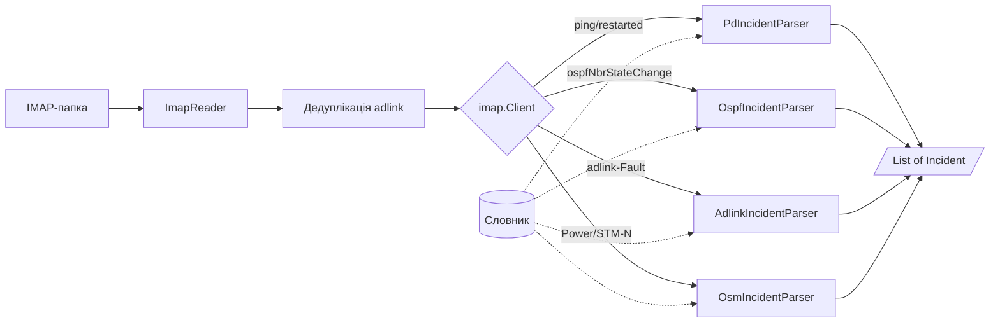
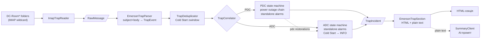

# NOCZvit

Звіт NOC про інциденти, зареєстровані в автоматичному режимі системами Zabbix та OSM.

## Опис

NOCZvit — Java-програма, яка автоматично формує щозмінний звіт для NOC. Програма:

- Читає IMAP-папку із повідомленнями від Zabbix та OSM
- Групує та фільтрує інциденти за послугами
- Отримує показники температури обладнання через SNMP (Celsius / Ramos)
- Отримує список боржників із MSSQL (опціонально)
- Генерує AI-резюме зміни через Anthropic Claude API (опціонально)
- Надсилає готовий HTML-звіт на e-mail

## Схема роботи

### Загальний потік



### Маршрутизація IMAP-повідомлень



### Обробка SNMP-трапів Emerson (ДБЖ/кондиціонери)



### Структура класів

```mermaid
classDiagram
    class NOCZvit {
        +main(String[] args)
    }
    class Config {
        +isIncidentsEnabled() bool
        +isZabbixEnabled() bool
        +isClaudeEnabled() bool
        +isDebug() bool
        +getClaudeApiKey() String
        +getClaudeModel() String
        +getHistoryResumeUrl() String
    }
    class Dictionary {
        +lookupPD(key) String
        +lookupSDH(key) String
    }
    class EmailSender {
        +sendReport(subject, body)
    }
    class Debtors {
        +toString() String
    }

    class ImapClient["imap.Client"] {
        +prepareImapFolder() List~Incident~
        -deduplicateAdlink()
    }
    class ImapReader {
        +readMessages() List~RawMessage~
    }
    class RawMessage {
        <<record>>
        +subject() String
        +body() String
        +unixDate() long
        +dateStr() String
    }
    class PdIncidentParser {
        +parse(msg) Optional~Incident~
    }
    class OsmIncidentParser {
        +parse(msg) Optional~Incident~
    }
    class OspfIncidentParser {
        +parse(msg) Optional~Incident~
    }
    class AdlinkIncidentParser {
        +parse(msg) Optional~Incident~
    }

    class Incident {
        <<record>>
        +location() String
        +device() String
        +messageTs() long
        +eventTs() long
        +source() Source
        +status() Status
        +description() String
        +reviewNames() List~String~
    }
    class Source {
        <<enumeration>>
        PD
        OSM
        ZABBIX
    }
    class Status {
        <<enumeration>>
        START
        END
        NONE
    }

    class ZabbixProblem {
        <<record>>
        +host() String
        +name() String
        +clock() long
        +rClock() long
        +isActive() bool
    }
    class ZabbixIncidentConverter {
        +convert(ZabbixProblem) List~Incident~
    }
    class ProblemFilter {
        +filter(problems, imapIncidents) List~ZabbixProblem~
    }

    class IncidentSectionBuilder {
        +build(incidents, zabbix, from, to) String
        +build(incidents, zabbix, from, to, summaryHtml) String
    }
    class SummaryClient["claude.SummaryClient"] {
        +generateSummary(incidents, from, to) String
        +generateSummary(incidents, from, to, trapPlainText) String
    }
    class ResumeHistory["history.ResumeHistory"] {
        +findPrevious(currentFrom) ResumeRecord
        +save(periodFrom, periodTo, summaryText)
    }
    class ResumeRecord["history.ResumeRecord"] {
        <<record>>
        +periodFrom() long
        +periodTo() long
        +createdAt() long
        +summaryText() String
    }
    class SnmpClient["snmp.Client"] {
        +getCelsius(from, to, zabbix) String
        +getRamos() String
    }
    class ZabbixClient["zabbix.Client"] {
        +login() bool
        +getProblems(from, to) List~ZabbixProblem~
        +getPingGraphRow() String
        +getGraphRow() String
    }

    NOCZvit --> Config
    NOCZvit --> ImapClient
    NOCZvit --> ZabbixClient
    NOCZvit --> SnmpClient
    NOCZvit --> IncidentSectionBuilder
    NOCZvit --> SummaryClient
    NOCZvit --> EmailSender
    NOCZvit --> Debtors

    ImapClient --> ImapReader
    ImapClient --> Dictionary
    ImapClient --> PdIncidentParser
    ImapClient --> OsmIncidentParser
    ImapClient --> OspfIncidentParser
    ImapClient --> AdlinkIncidentParser

    ImapReader ..> RawMessage : creates

    PdIncidentParser ..> RawMessage : reads
    PdIncidentParser ..> Dictionary : lookup
    PdIncidentParser ..> Incident : creates
    OsmIncidentParser ..> RawMessage : reads
    OsmIncidentParser ..> Dictionary : lookup
    OsmIncidentParser ..> Incident : creates
    OspfIncidentParser ..> RawMessage : reads
    OspfIncidentParser ..> Dictionary : lookup
    OspfIncidentParser ..> Incident : creates
    AdlinkIncidentParser ..> RawMessage : reads
    AdlinkIncidentParser ..> Dictionary : lookup
    AdlinkIncidentParser ..> Incident : creates

    Incident --> Source
    Incident --> Status

    ZabbixClient ..> ZabbixProblem : creates
    ProblemFilter ..> ZabbixProblem : filters
    ZabbixIncidentConverter ..> ZabbixProblem : reads
    ZabbixIncidentConverter ..> Dictionary : lookup
    ZabbixIncidentConverter ..> Incident : creates

    IncidentSectionBuilder ..> Incident : renders
    IncidentSectionBuilder ..> ZabbixClient : Ping-графіки

    SummaryClient ..> Incident : reads
    SummaryClient ..> Config : apiKey + model
    SummaryClient --> ResumeHistory
    ResumeHistory ..> ResumeRecord : creates

    SnmpClient ..> ZabbixClient : температурні графіки

    class ImapTrapReader["trap.ImapTrapReader"] {
        +readTraps(fetchAll, from, to) List~RawMessage~
    }
    class EmersonTrapParser["trap.EmersonTrapParser"] {
        +parse(messages) List~TrapEvent~
    }
    class TrapDeduplicator["trap.TrapDeduplicator"] {
        +deduplicate(events, windowSec) List~TrapEvent~
    }
    class TrapCorrelator["trap.TrapCorrelator"] {
        +correlate(events) List~TrapIncident~
    }
    class EmersonTrapSection["trap.EmersonTrapSection"] {
        +build(incidents) SectionResult
    }
    class TrapEvent["trap.TrapEvent"] {
        <<record>>
        +timestamp() Instant
        +ip() String
        +hostname() String
        +trapType() String
        +deviceClass() String
    }
    class TrapIncident["trap.TrapIncident"] {
        <<record>>
        +deviceClass() String
        +hostname() String
        +ip() String
        +severity() Severity
        +activatedAt() Instant
        +clearedAt() Instant
        +description() String
        +details() List~String~
        +isClosed() bool
        +roomId() String
    }
    class TrapSeverity["TrapIncident.Severity"] {
        <<enumeration>>
        ALARM
        WARNING
        INFO
    }

    NOCZvit --> ImapTrapReader
    NOCZvit --> EmersonTrapSection
    ImapTrapReader ..> RawMessage : creates
    EmersonTrapParser ..> RawMessage : reads
    EmersonTrapParser ..> TrapEvent : creates
    TrapDeduplicator ..> TrapEvent : filters
    TrapCorrelator ..> TrapEvent : reads
    TrapCorrelator ..> TrapIncident : creates
    EmersonTrapSection ..> TrapIncident : renders
    TrapIncident --> TrapSeverity
    SummaryClient ..> EmersonTrapSection : plain text
```



## Вимоги

- **JDK**: 21 або новіше (перевірено на JDK 21 та JDK 24+)
- **Maven**: 3.6.0 або новіше
- **Залежності** (підтягуються автоматично через `pom.xml`):
  - Jakarta Mail `com.sun.mail:jakarta.mail:2.0.2`
  - SNMP4J `org.snmp4j:snmp4j:3.9.7`
  - Apache Commons Lang `org.apache.commons:commons-lang3:3.20.0`
  - Apache Commons Text `org.apache.commons:commons-text:1.15.0`
  - Gson `com.google.code.gson:gson:2.13.2`
  - jTDS `net.sourceforge.jtds:jtds:1.3.1`
  - Lombok `org.projectlombok:lombok:1.18.46` (provided)
  - Anthropic Java SDK `com.anthropic:anthropic-java:2.34.0` (опціонально, для Claude AI)
  - SQLite JDBC `org.xerial:sqlite-jdbc:3.51.2.0` (опціонально, для міжзмінної пам'яті Claude)

## Збирання

```bash
mvn clean package
```

Результат — `target/NOCZvit-1.13.0.jar` (uber-JAR з усіма залежностями).

## Запуск

```bash
java -jar target/NOCZvit-1.13.0.jar [OPTIONS]
```

### Параметри командного рядка

| Параметр | Опис |
|---|---|
| `--config=<шлях>` | Шлях до зовнішнього файлу конфігурації (за замовчуванням — вбудований `noczvit.properties`) |
| `--dictionarypd=<шлях>` | Шлях до зовнішнього словника PD |
| `--dictionarysdh=<шлях>` | Шлях до зовнішнього словника SDH |
| `--incidents` / `--no-incidents` | Увімкнути/вимкнути блок інцидентів |
| `--temperature` / `--no-temperature` | Увімкнути/вимкнути блок температури (SNMP Celsius) |
| `--ramos` / `--no-ramos` | Увімкнути/вимкнути блок Ramos |
| `--zabbix` / `--no-zabbix` | Увімкнути/вимкнути вбудовування графіків температури з Zabbix |
| `--claude` / `--no-claude` | Увімкнути/вимкнути AI-резюме зміни (за замовчуванням: увімк. в нормальному режимі, вимк. в `--debug`) |
| `--debug` / `--no-debug` | Дебаг-режим: звіт надсилається на `email.toDebug` замість `email.to` |

Параметри командного рядка мають пріоритет над налаштуваннями у `noczvit.properties`.

### Приклад запуску в дебаг-режимі

```bash
java -jar target/NOCZvit-1.13.0.jar --debug --no-incidents
```

## Налаштування

Основний конфігураційний файл — `src/main/resources/noczvit.properties` (вбудовується в JAR під час збирання). За потреби можна передати зовнішній файл через `--config=`.

### Ключові параметри

```properties
# Режими
debug=false
incidents=true
temperature=true
ramos=false

# IMAP
mail.hostname=imap.example.com
mail.username=noc@example.com
mail.password=secret
mail.ssl=true
mail.zabbixFolder=Zabbix

# SNMP
snmp.community=public
snmp.community.celsius=public
snmp.community.ramos=public
snmp.hosts.suffix=example.com
snmp.hosts=host1 label:desc=1.3.6.1.4.1.2636.3.1.13.1.5.7.1.0.0;temp=1.3.6.1.4.1.2636.3.1.13.1.7.7.1.0.0

# E-mail вихідний
email.from=noc@example.com
email.replyTo=noc@example.com
email.to=shift@example.com,manager@example.com
email.toDebug=dev@example.com

# Zabbix (опціонально, для графіків температури)
zabbix=false
zabbix.api=https://zabbix.example.com/zabbix/api_jsonrpc.php
zabbix.url=https://zabbix.example.com/zabbix
zabbix.username=noczvit
zabbix.password=secret
zabbix.graphwidth=640
zabbix.graphheight=83

# MSSQL (опціонально, для списку боржників)
account-mssql-server=sqlserver
account-mssql-database=Accounting
account-mssql-user=reader
account-mssql-password=secret
accequipment-mssql-server=sqlserver
accequipment-mssql-database=Equipment
accequipment-mssql-user=reader
accequipment-mssql-password=secret

# Claude AI (опціонально, для резюме зміни)
# API-ключ генерується на https://console.anthropic.com (окремий від підписки claude.ai)
# claude.apikey=sk-ant-...
# claude.model=claude-haiku-4-5
# claude=false  ← явно вимкнути завжди; claude=true ← вмикати навіть в --debug
# Міжзмінна пам'ять: зберігає резюме попередньої зміни у SQLite для контексту
# history.resume=jdbc:sqlite:/var/lib/noczvit/history.db

# SNMP-трапи Emerson (ДБЖ/кондиціонери Датацентру — опціонально)
# Підтримує wildcard-патерн (* = будь-які суфікси на тому ж рівні)
# snmp.trap.folder=INBOX.Internal.SNMP Traps.DC-Room*
# snmp.trap.dedup.seconds=30
# snmp.trap.correlation.minutes=10
# snmp.trap.coldstart.link.minutes=5
```

### Claude AI (резюме зміни)

Опціональна секція на початку звіту — людськомовний опис зміни (до 10 речень), сформований Anthropic Claude на основі **об'єднаного списку інцидентів** (IMAP + Zabbix), тобто тих самих даних, що відображаються в HTML-таблиці.

**Що входить до промпту:**
- Звітний період та кількість унікальних подій (START-записи)
- Повний список інцидентів (location, device, опис, статус)
- Попередньо обчислений факт: незакриті інциденти на кінець зміни
- Резюме попередньої зміни (якщо налаштовано `history.resume`) — для порівняння та відстеження наскрізних інцидентів

**Що генерує Claude:**
- Загальна картина зміни (кількість та характер подій)
- Ключові локації та пристрої з проблемами
- Перелік незакритих інцидентів (якщо є)
- Різний термін для ночі: «кінець звітного періоду» (20:00–07:59) vs «кінець зміни» (08:00–19:59)
- Якщо є попереднє резюме: що вирішено, що перейшло з попередньої зміни

**Вбудовані доменні знання в промпті:**
- `Routing Engine: High CPU utilization` на Juniper — інформаційна подія, не впливає на трафік (TFEB/PFE окремо від RE); описується нейтрально
- При згадуванні BGP обов'язково вказується ім'я сусіда (neighbor)
- Мова резюме: українська без русизмів, офіційний стиль

**Отримання API-ключа:**
1. Зареєструватися на [console.anthropic.com](https://console.anthropic.com) *(окремий акаунт від claude.ai)*
2. Додати платіжний метод
3. Згенерувати ключ (`sk-ant-...`) та вказати його в `claude.apikey`

**Поведінка за замовчуванням** (без явного `claude=` у конфігурації):

| Режим запуску | Claude |
|---|---|
| Звичайний (без `--debug`) | **увімкнений** (якщо є `claude.apikey`) |
| `--debug` | **вимкнений** |
| `--claude` (явно) | увімкнений незалежно від режиму |
| `--no-claude` (явно) | вимкнений незалежно від режиму |

**Орієнтовна вартість** на моделі `claude-haiku-4-5`: ~$0.01–0.02/день (2 виклики × ~3 000–5 000 вхідних + ~300 вихідних токенів залежно від кількості інцидентів за зміну). Бюджету $5 вистачить приблизно на **1–2 роки**.

#### Міжзмінна пам'ять (`history.resume`)

Опціональна функція: після кожного успішного виклику Claude зберігає **чистий текст** (без HTML) резюме у SQLite-файл. Перед наступним викликом читається резюме попередньої зміни та передається до промпту — Claude може згадати, які інциденти були незакриті, та порівняти стан мережі.

```properties
history.resume=jdbc:sqlite:/var/lib/noczvit/history.db
```

- База даних створюється автоматично при першому запуску (SQLite 3.24+, UPSERT-семантика)
- Зберігається по одному запису на `(period_from, period_to)` — повторні запуски для того ж періоду оновлюють запис без дублювання
- Якщо файл БД недоступний — програма продовжує роботу без міжзмінної пам'яті (попередження в лозі)

### SNMP-трапи Emerson (ДБЖ та кондиціонери Датацентру)

Опціональна секція звіту — «Зареєстровані події по ДБЖ та кондиціонерах Emerson на Датацентрі». Читає листи з SNMP-трапами від пристроїв Emerson/Liebert (ДБЖ та прецизійні кондиціонери) із папок IMAP, корелює сирі трапи в логічні події та вбудовує HTML-таблицю між розділом інцидентів і температурою.

Вмикається через `snmp.trap.folder` — підтримує wildcard (наприклад, `DC-Room*`).

#### Класифікація пристроїв

| Клас | Hostname-префікс | Опис |
|------|-----------------|------|
| `adc` | `adc-*` | Прецизійний кондиціонер (Air-handling DC unit) |
| `pdc` | `pdc-*` | Блок безперебійного живлення (Power DC unit, UPS) |

#### Таблиця типів трапів

| Trap type (нормалізований) | Опис українською | Клас | Severity | Примітка |
|---|---|---|---|---|
| `Active:Alarm:Loss of Mains` | Зникнення мережевого живлення | PDC | ALARM | Корінь ланцюжка відключення |
| `Cleared:Alarm:Loss of Mains` | Відновлення мережевого живлення | PDC | — | Закриває ланцюжок |
| `Active:Alarm:Battery Discharging` | Розряд батарей ДБЖ | PDC | ALARM | Вторинна в ланцюжку |
| `Active:Alarm:MMS On Battery` | MMS переключено на живлення від батарей | PDC | ALARM | Вторинна в ланцюжку (прошивка r3/r4) |
| `Active:Alarm:Bypass Not Available` | Байпас недоступний | PDC | WARNING | Вторинна в ланцюжку |
| `Active:Alarm:Low Battery` | Низький заряд батарей ДБЖ | PDC | ALARM | Вторинна або самостійна |
| `Active:Alarm:Unit Off` | Пристрій вимкнено | PDC/ADC | WARNING | Самостійна подія |
| `Active:Alarm:Loss of Air Flow` | Відсутність потоку повітря | ADC | ALARM | Самостійна подія |
| `Active:Alarm:Compressor Fault` | Несправність компресора | ADC | ALARM | Самостійна подія |
| `Active:Alarm:Master Unit Communication Lost` | Втрата зв'язку з основним блоком | ADC | WARNING | Самостійна подія |
| `Active:Alarm:High Temperature` | Висока температура | ADC | WARNING | Самостійна подія |
| `Active:Alarm:Low Temperature` | Низька температура | ADC | WARNING | Самостійна подія |
| `Active:Alarm:High Humidity` | Висока вологість | ADC | WARNING | Самостійна подія |
| `Active:Alarm:Low Humidity` | Низька вологість | ADC | WARNING | Самостійна подія |
| `Active:Alarm:Fan Fault` | Несправність вентилятора | ADC | WARNING | Самостійна подія |
| `Active:Alarm:Unit On Standby` | — | PDC/ADC | — | **Ігнорується** (нормальний стан) |
| `Active:Alarm:Unit On` | — | PDC/ADC | — | **Ігнорується** (нормальний стан) |
| `Cold Start` | Перезапуск картки моніторингу | PDC/ADC | INFO | Дедуплікується (±30 с) |
| `System Return to Normal` | — | PDC/ADC | — | Закриває всі відкриті події на пристрої |

> **Важливо:** Liebert-специфічні трапи передаються в лапках (`"Active:Alarm:..."`) з нерівномірними пробілами після двокрапки (`": "`). `EmersonTrapParser` автоматично нормалізує їх: знімає лапки і стискає `": "` → `":"`.

#### Ланцюжки подій (TrapCorrelator)

**PDC — ланцюжок відключення живлення:**

Коли приходить `Active:Alarm:Loss of Mains`, відкривається ланцюжок. Наступні трапи (`Battery Discharging`, `MMS On Battery`, `Bypass Not Available`, `Low Battery`) від того ж PDC вважаються вторинними і додаються до опису. Ланцюжок закривається при `Cleared:Alarm:Loss of Mains` або `System Return to Normal`.

- Якщо серед вторинних є `Battery Discharging` або `MMS On Battery` → у описі додається: «ДБЖ живив навантаження від батарей.»
- Якщо ланцюжок не закрито до кінця зміни → «До кінця зміни не відновлено.»

**ADC — самостійні події:**

Всі ADC-трапи є самостійними парами Active/Cleared. `System Return to Normal` закриває всі відкриті події на тому ж ADC-пристрої.

**Cold Start — зв'язування з відновленням живлення:**

ADC Cold Start, що з'являється протягом `snmp.trap.coldstart.link.minutes` (за замовчуванням 5 хв) після відновлення живлення на PDC **в тій же кімнаті** — автоматично анотується як «Пов'язано з відновленням мережевого живлення.» Кімната визначається з hostname: `adc-r1-1` → `r1`.

#### Порядок виводу пристроїв у звіті

Спочатку всі ADC-пристрої (кондиціонери) у алфавітному порядку, потім PDC (ДБЖ) у алфавітному порядку.

#### Інтеграція з Claude AI

Якщо увімкнено і трапи, і Claude — до промпту додається plain-text блок подій з маркерами ізоляції:
```
=== ПОДІЇ ОБЛАДНАННЯ ДАТАЦЕНТРУ (ТІЛЬКИ ЦЯ ЗМІНА — НЕ ПЕРЕНОСИТИ В НАСТУПНІ) ===
...
=== КІНЕЦЬ ПОДІЙ ОБЛАДНАННЯ ДАТАЦЕНТРУ ===
```
Claude отримує інструкцію: ці події належать **виключно поточній зміні** і не мають переноситися в резюме наступного звітного періоду.

### Словники

- `dictionary_pd.txt` — фрази для розпізнавання PD-інцидентів
- `dictionary_sdh.txt` — фрази для розпізнавання SDH-інцидентів

## Структура проекту

```
NOCZvit/
├── src/main/java/net/ukrcom/noczvit/
│   ├── NOCZvit.java               — точка входу
│   ├── Config.java                — зчитування та валідація конфігурації (Lombok)
│   ├── Dictionary.java            — словники PD/SDH (regex-lookup з кешем; нормалізація hostname: prefix ^[rsp]/ies/alca- + суфікс -N)
│   ├── Debtors.java               — список боржників із MSSQL
│   ├── imap/
│   │   ├── Client.java            — оркестратор: читання IMAP → парсинг → List<Incident>
│   │   ├── ImapReader.java        — I/O: читання сирих повідомлень з IMAP-папки
│   │   ├── RawMessage.java        — record: незмінний DTO (subject, body, unixDate, dateStr)
│   │   ├── PdIncidentParser.java  — Zabbix ICMP ping / restarted
│   │   ├── OsmIncidentParser.java — OSM/SDH (Power, STM-N); Trap value → точний час події
│   │   ├── OspfIncidentParser.java — Zabbix ospfNbrStateChange
│   │   ├── AdlinkIncidentParser.java — сухі контакти adlink (card/port/line → словник)
│   │   └── DateUtils.java         — конвертація місяців у локалізований рядок
│   ├── model/
│   │   └── Incident.java          — record: доменна модель інциденту (Source, Status, reviewNames)
│   ├── report/
│   │   └── IncidentSectionBuilder.java — HTML-секція інцидентів (групування, Ping-графіки)
│   ├── claude/
│   │   └── SummaryClient.java     — Claude API: генерація короткого резюме зміни (опціонально)
│   ├── history/
│   │   ├── ResumeHistory.java     — SQLite-сховище міжзмінних резюме (DDL, findPrevious, save/upsert)
│   │   └── ResumeRecord.java      — record: DTO одного збереженого резюме
│   ├── trap/
│   │   ├── ImapTrapReader.java    — читання SNMP-трап листів з IMAP-папок (wildcard-підтримка)
│   │   ├── EmersonTrapParser.java — парсинг subject+body листа → TrapEvent (нормалізація типу трапу)
│   │   ├── TrapDeduplicator.java  — дедуплікація Cold Start трапів у часовому вікні
│   │   ├── TrapCorrelator.java    — state machine: ланцюжки PDC + самостійні ADC + Cold Start linking
│   │   ├── EmersonTrapSection.java — формування HTML-секції та plain-text для Claude
│   │   ├── TrapEvent.java         — record: один сирий нормалізований трап
│   │   └── TrapIncident.java      — record: логічна скорельована подія (Severity, activatedAt, clearedAt)
│   ├── snmp/
│   │   └── Client.java            — SNMP-опитування (virtual threads, паралельно)
│   └── zabbix/
│       ├── Client.java            — Zabbix API: login, event.get history, host/graph lookup, chart2.php PNG
│       ├── ZabbixProblem.java     — record: host, name, clock, rClock; isActive()
│       ├── ZabbixIncidentConverter.java — ZabbixProblem → List<Incident> з Dictionary lookup
│       └── ProblemFilter.java     — фільтрація: порожній host, SDH-OSM, No SNMP, OSPF, дублікати IMAP
├── src/main/resources/
│   ├── noczvit.properties         — конфігурація за замовчуванням
│   ├── logback.xml                — конфігурація логування (Logback)
│   ├── dictionary_pd.txt          — словник PD/OSPF/adlink (regex → назва / опис)
│   ├── dictionary_sdh.txt         — словник SDH/OSM (regex → назва виносу)
│   ├── help.txt
│   └── version.properties
└── pom.xml
```

## Версіонування

Проект дотримується [Semantic Versioning](https://semver.org/):

- **MAJOR** — несумісні зміни API або конфігурації
- **MINOR** — нова функціональність зі зворотною сумісністю
- **PATCH** — виправлення помилок

Версія автоматично підставляється в `version.properties` під час збирання і відображається в e-mail заголовку `X-PoweredBy`.
