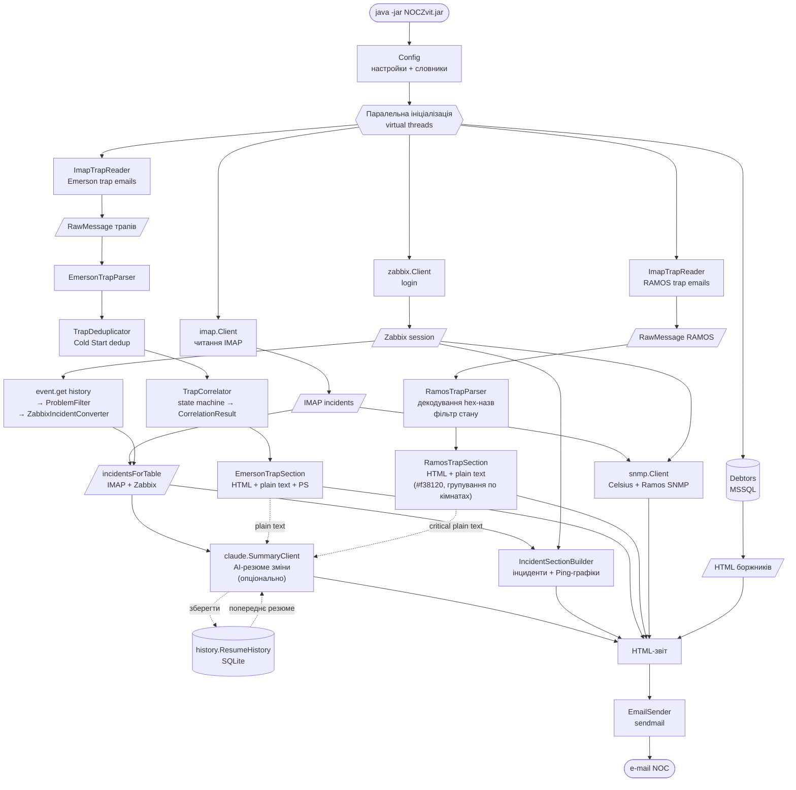
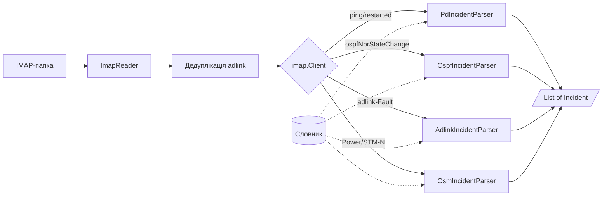
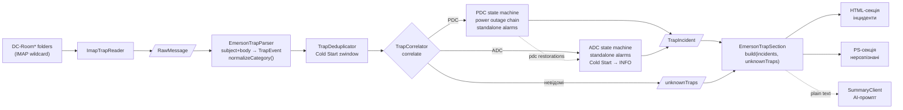

# NOCZvit

Звіт NOC про інциденти, зареєстровані в автоматичному режимі системами Zabbix та OSM.

## Опис

NOCZvit — Java-програма, яка автоматично формує щозмінний звіт для NOC. Програма:

- Читає IMAP-папку із повідомленнями від Zabbix та OSM
- Групує та фільтрує інциденти за послугами
- Отримує показники температури обладнання через SNMP (Celsius / Ramos)
- Отримує список боржників із MSSQL (опціонально)
- Генерує AI-резюме зміни через Anthropic Claude API (опціонально)
- Надсилає готовий HTML-звіт на e-mail

## Схема роботи

### Загальний потік



### Маршрутизація IMAP-повідомлень



### Обробка SNMP-трапів Emerson (ДБЖ/кондиціонери)



### Структура класів

```mermaid
classDiagram
    class NOCZvit {
        +main(String[] args)
    }
    class Config {
        +isIncidentsEnabled() bool
        +isZabbixEnabled() bool
        +isClaudeEnabled() bool
        +isDebug() bool
        +getClaudeApiKey() String
        +getClaudeModel() String
        +getClaudeMaxTokens() int
        +getHistoryResumeUrl() String
        +isTrapEnabled() bool
        +isRamosTrapEnabled() bool
        +getRamosTrapFolder() String
    }
    class Dictionary {
        +lookupPD(key) String
        +lookupSDH(key) String
    }
    class EmailSender {
        +sendReport(subject, body)
    }
    class Debtors {
        +toString() String
    }

    class ImapClient["imap.Client"] {
        +prepareImapFolder() List~Incident~
        -deduplicateAdlink()
    }
    class ImapReader {
        +readMessages() List~RawMessage~
    }
    class RawMessage {
        <<record>>
        +subject() String
        +body() String
        +unixDate() long
        +dateStr() String
        +inReplyTo() String
    }
    class PdIncidentParser {
        +parse(msg) Optional~Incident~
    }
    class OsmIncidentParser {
        +parse(msg) Optional~Incident~
    }
    class OspfIncidentParser {
        +parse(msg) Optional~Incident~
    }
    class AdlinkIncidentParser {
        +parse(msg) Optional~Incident~
    }

    class Incident {
        <<record>>
        +location() String
        +device() String
        +messageTs() long
        +eventTs() long
        +source() Source
        +status() Status
        +description() String
        +reviewNames() List~String~
        +inReplyTo() String
    }
    class Source {
        <<enumeration>>
        PD
        OSM
        ZABBIX
    }
    class Status {
        <<enumeration>>
        START
        END
        NONE
    }

    class ZabbixProblem {
        <<record>>
        +host() String
        +name() String
        +clock() long
        +rClock() long
        +isActive() bool
    }
    class ZabbixIncidentConverter {
        +convert(ZabbixProblem) List~Incident~
    }
    class ProblemFilter {
        +filter(problems, imapIncidents) List~ZabbixProblem~
    }

    class IncidentSectionBuilder {
        +build(incidents, zabbix, from, to) String
        +build(incidents, zabbix, from, to, summaryHtml) String
        -pairIncidents(incidents) List~IncidentRow~
        -formatDuration(seconds) String
    }
    class IncidentRow {
        <<record>>
        +start() Incident
        +end() Incident
        +location() String
        +sortKey() long
        +device() String
        +mergedReviewNames() List~String~
    }
    class SummaryClient["claude.SummaryClient"] {
        +generateSummary(incidents, from, to) String
        +generateSummary(incidents, from, to, trapPlainText) String
    }
    class ResumeHistory["history.ResumeHistory"] {
        +findPrevious(currentFrom) ResumeRecord
        +save(periodFrom, periodTo, summaryText)
    }
    class ResumeRecord["history.ResumeRecord"] {
        <<record>>
        +periodFrom() long
        +periodTo() long
        +createdAt() long
        +summaryText() String
    }
    class SnmpClient["snmp.Client"] {
        +getCelsius(from, to, zabbix) String
        +getRamos() String
    }
    class ZabbixClient["zabbix.Client"] {
        +login() bool
        +getProblems(from, to) List~ZabbixProblem~
        +getPingGraphRow() String
        +getGraphRow() String
    }

    NOCZvit --> Config
    NOCZvit --> ImapClient
    NOCZvit --> ZabbixClient
    NOCZvit --> SnmpClient
    NOCZvit --> IncidentSectionBuilder
    NOCZvit --> SummaryClient
    NOCZvit --> EmailSender
    NOCZvit --> Debtors

    ImapClient --> ImapReader
    ImapClient --> Dictionary
    ImapClient --> PdIncidentParser
    ImapClient --> OsmIncidentParser
    ImapClient --> OspfIncidentParser
    ImapClient --> AdlinkIncidentParser

    ImapReader ..> RawMessage : creates

    PdIncidentParser ..> RawMessage : reads
    PdIncidentParser ..> Dictionary : lookup
    PdIncidentParser ..> Incident : creates
    OsmIncidentParser ..> RawMessage : reads
    OsmIncidentParser ..> Dictionary : lookup
    OsmIncidentParser ..> Incident : creates
    OspfIncidentParser ..> RawMessage : reads
    OspfIncidentParser ..> Dictionary : lookup
    OspfIncidentParser ..> Incident : creates
    AdlinkIncidentParser ..> RawMessage : reads
    AdlinkIncidentParser ..> Dictionary : lookup
    AdlinkIncidentParser ..> Incident : creates

    Incident --> Source
    Incident --> Status

    ZabbixClient ..> ZabbixProblem : creates
    ProblemFilter ..> ZabbixProblem : filters
    ZabbixIncidentConverter ..> ZabbixProblem : reads
    ZabbixIncidentConverter ..> Dictionary : lookup
    ZabbixIncidentConverter ..> Incident : creates

    IncidentSectionBuilder ..> Incident : renders
    IncidentSectionBuilder ..> ZabbixClient : Ping-графіки

    SummaryClient ..> Incident : reads
    SummaryClient ..> Config : apiKey + model + maxTokens
    SummaryClient --> ResumeHistory
    ResumeHistory ..> ResumeRecord : creates

    SnmpClient ..> ZabbixClient : температурні графіки

    class ImapTrapReader["trap.ImapTrapReader"] {
        +readTraps(fetchAll, from, to) List~RawMessage~
        +readTrapsFromFolder(fetchAll, from, to, folder) List~RawMessage~
    }
    class EmersonTrapParser["trap.EmersonTrapParser"] {
        +parse(messages) List~TrapEvent~
    }
    class TrapDeduplicator["trap.TrapDeduplicator"] {
        +deduplicate(events, windowSec) List~TrapEvent~
    }
    class TrapCorrelator["trap.TrapCorrelator"] {
        +correlate(events) CorrelationResult
    }
    class CorrelationResult["TrapCorrelator.CorrelationResult"] {
        <<record>>
        +incidents() List~TrapIncident~
        +unknownTraps() List~TrapEvent~
    }
    class EmersonTrapSection["trap.EmersonTrapSection"] {
        +build(incidents) SectionResult
        +build(incidents, unknownTraps) SectionResult
    }
    class SectionResult["EmersonTrapSection.SectionResult"] {
        <<record>>
        +html() String
        +plainText() String
        +unknownHtml() String
        +isEmpty() bool
    }
    class TrapEvent["trap.TrapEvent"] {
        <<record>>
        +timestamp() Instant
        +ip() String
        +hostname() String
        +trapType() String
        +deviceClass() String
    }
    class TrapIncident["trap.TrapIncident"] {
        <<record>>
        +deviceClass() String
        +hostname() String
        +ip() String
        +severity() Severity
        +activatedAt() Instant
        +clearedAt() Instant
        +description() String
        +details() List~String~
        +isClosed() bool
        +roomId() String
    }
    class TrapSeverity["TrapIncident.Severity"] {
        <<enumeration>>
        ALARM
        WARNING
        INFO
    }

    class RamosTrapEvent["trap.RamosTrapEvent"] {
        <<record>>
        +timestamp() Instant
        +ip() String
        +state() String
        +sensorName() String
        +sensorType() String
        +room() String
    }
    class RamosTrapParser["trap.RamosTrapParser"] {
        +parse(messages) List~RamosTrapEvent~
    }
    class RamosTrapSection["trap.RamosTrapSection"] {
        +build(events) RamosSectionResult
    }
    class RamosSectionResult["RamosTrapSection.SectionResult"] {
        <<record>>
        +html() String
        +plainText() String
        +isEmpty() bool
    }

    NOCZvit --> ImapTrapReader
    NOCZvit --> EmersonTrapSection
    NOCZvit --> RamosTrapSection
    ImapTrapReader ..> RawMessage : creates
    EmersonTrapParser ..> RawMessage : reads
    EmersonTrapParser ..> TrapEvent : creates
    TrapDeduplicator ..> TrapEvent : filters
    TrapCorrelator ..> TrapEvent : reads
    TrapCorrelator ..> CorrelationResult : creates
    EmersonTrapSection ..> TrapIncident : renders
    EmersonTrapSection ..> TrapEvent : reads unknownTraps
    EmersonTrapSection ..> SectionResult : creates
    TrapIncident --> TrapSeverity
    SummaryClient ..> EmersonTrapSection : plain text
    RamosTrapParser ..> RawMessage : reads
    RamosTrapParser ..> RamosTrapEvent : creates
    RamosTrapSection ..> RamosTrapEvent : renders
    RamosTrapSection ..> RamosSectionResult : creates
    SummaryClient ..> RamosTrapSection : critical plain text
```



## Вимоги

- **JDK**: 21 або новіше (перевірено на JDK 21 та JDK 24+)
- **Maven**: 3.6.0 або новіше
- **Залежності** (підтягуються автоматично через `pom.xml`):
  - Jakarta Mail `com.sun.mail:jakarta.mail:2.0.2`
  - SNMP4J `org.snmp4j:snmp4j:3.9.7`
  - Apache Commons Lang `org.apache.commons:commons-lang3:3.20.0`
  - Apache Commons Text `org.apache.commons:commons-text:1.15.0`
  - Gson `com.google.code.gson:gson:2.13.2`
  - jTDS `net.sourceforge.jtds:jtds:1.3.1`
  - Lombok `org.projectlombok:lombok:1.18.46` (provided)
  - Anthropic Java SDK `com.anthropic:anthropic-java:2.34.0` (опціонально, для Claude AI)
  - SQLite JDBC `org.xerial:sqlite-jdbc:3.51.2.0` (опціонально, для міжзмінної пам'яті Claude)

## Збирання

```bash
mvn clean package
```

Результат — `target/NOCZvit-1.16.0.jar` (uber-JAR з усіма залежностями).

## Запуск

```bash
java -jar target/NOCZvit-1.16.0.jar [OPTIONS]
```

### Параметри командного рядка

| Параметр | Опис |
|---|---|
| `--config=<шлях>` | Шлях до зовнішнього файлу конфігурації (за замовчуванням — вбудований `noczvit.properties`) |
| `--dictionarypd=<шлях>` | Шлях до зовнішнього словника PD |
| `--dictionarysdh=<шлях>` | Шлях до зовнішнього словника SDH |
| `--incidents` / `--no-incidents` | Увімкнути/вимкнути блок інцидентів |
| `--temperature` / `--no-temperature` | Увімкнути/вимкнути блок температури (SNMP Celsius) |
| `--ramos` / `--no-ramos` | Увімкнути/вимкнути блок Ramos |
| `--zabbix` / `--no-zabbix` | Увімкнути/вимкнути вбудовування графіків температури з Zabbix |
| `--claude` / `--no-claude` | Увімкнути/вимкнути AI-резюме зміни (за замовчуванням: увімк. в нормальному режимі, вимк. в `--debug`) |
| `--debug` / `--no-debug` | Дебаг-режим: звіт надсилається на `email.toDebug` замість `email.to` |

Параметри командного рядка мають пріоритет над налаштуваннями у `noczvit.properties`.

### Приклад запуску в дебаг-режимі

```bash
java -jar target/NOCZvit-1.16.0.jar --debug --no-incidents
```

## Налаштування

Основний конфігураційний файл — `src/main/resources/noczvit.properties` (вбудовується в JAR під час збирання). За потреби можна передати зовнішній файл через `--config=`.

### Ключові параметри

```properties
# Режими
debug=false
incidents=true
temperature=true
ramos=false

# IMAP
mail.hostname=imap.example.com
mail.username=noc@example.com
mail.password=secret
mail.ssl=true
mail.zabbixFolder=Zabbix

# SNMP
snmp.community=public
snmp.community.celsius=public
snmp.community.ramos=public
snmp.hosts.suffix=example.com
snmp.hosts=host1 label:desc=1.3.6.1.4.1.2636.3.1.13.1.5.7.1.0.0;temp=1.3.6.1.4.1.2636.3.1.13.1.7.7.1.0.0

# E-mail вихідний
email.from=noc@example.com
email.replyTo=noc@example.com
email.to=shift@example.com,manager@example.com
email.toDebug=dev@example.com

# Zabbix (опціонально, для графіків температури)
zabbix=false
zabbix.api=https://zabbix.example.com/zabbix/api_jsonrpc.php
zabbix.url=https://zabbix.example.com/zabbix
zabbix.username=noczvit
zabbix.password=secret
zabbix.graphwidth=640
zabbix.graphheight=83

# MSSQL (опціонально, для списку боржників)
account-mssql-server=sqlserver
account-mssql-database=Accounting
account-mssql-user=reader
account-mssql-password=secret
accequipment-mssql-server=sqlserver
accequipment-mssql-database=Equipment
accequipment-mssql-user=reader
accequipment-mssql-password=secret

# Claude AI (опціонально, для резюме зміни)
# API-ключ генерується на https://console.anthropic.com (окремий від підписки claude.ai)
# claude.apikey=sk-ant-...
# claude.model=claude-haiku-4-5
# claude.tokens=4096      ← максимальна кількість вихідних токенів (за замовчуванням 4096)
# claude.minsentences=5   ← мінімальна кількість речень у резюме (за замовчуванням 5)
# claude.maxsentences=20  ← максимальна кількість речень у резюме (за замовчуванням 20)
# claude=false  ← явно вимкнути завжди; claude=true ← вмикати навіть в --debug
# Міжзмінна пам'ять: зберігає резюме попередньої зміни у SQLite для контексту
# history.resume=jdbc:sqlite:/var/lib/noczvit/history.db

# SNMP-трапи Emerson (ДБЖ/кондиціонери Датацентру — опціонально)
# Підтримує wildcard-патерн (* = будь-які суфікси на тому ж рівні)
# snmp.trap.folder=INBOX.Internal.SNMP Traps.DC-Room*
# snmp.trap.dedup.seconds=30
# snmp.trap.coldstart.link.minutes=5

# RAMOS трапи (датчики навколишнього середовища CONTEG RAMOS Ultra/Optima — опціонально)
# Підтримує wildcard-патерн аналогічно до snmp.trap.folder
# ramos.trap.folder=INBOX.Internal.SNMP Traps
```

### Claude AI (резюме зміни)

Опціональна секція на початку звіту — людськомовний опис зміни (до 10 речень), сформований Anthropic Claude на основі **об'єднаного списку інцидентів** (IMAP + Zabbix), тобто тих самих даних, що відображаються в HTML-таблиці.

**Що входить до промпту:**
- Звітний період та кількість унікальних подій (унікальних тредів після об'єднання START/END пар)
- Повний список інцидентів (location, device, опис, статус)
- Попередньо обчислений факт: незакриті інциденти на кінець зміни
- Резюме попередньої зміни (якщо налаштовано `history.resume`) — для порівняння та відстеження наскрізних інцидентів

**Що генерує Claude:**
- Загальна картина зміни (кількість та характер подій)
- Ключові локації та пристрої з проблемами
- Перелік незакритих інцидентів (якщо є)
- Різний термін для ночі: «кінець звітного періоду» (20:00–07:59) vs «кінець зміни» (08:00–19:59)
- Якщо є попереднє резюме: що вирішено, що перейшло з попередньої зміни

**Вбудовані доменні знання в промпті:**
- `Routing Engine: High CPU utilization` на Juniper — інформаційна подія, не впливає на трафік (TFEB/PFE окремо від RE); описується нейтрально
- При згадуванні BGP обов'язково вказується ім'я сусіда (neighbor)
- Слово «датацентр» дозволене лише для подій із блоку ПОДІЇ ОБЛАДНАННЯ ДАТАЦЕНТРУ (майданчик Прахових 50) та для інцидентів (IMAP чи Zabbix, незалежно від джерела) з обладнання, чий ідентифікатор починається на `ramos`, `rdc-`, `pdc-`, `adc-` чи `sga50-dc-`; решта локацій і пристроїв — звичайні виноси мережі («на виносі» / «на локації»)
- Ідентифікатори обладнання (поле «Обладнання», напр. `smur6-3`) відтворюються латиницею як є — без перекладу чи транслітерації в кирилицю
- Мова резюме: **системне повідомлення** вимагає відповіді виключно **українською** (без русизмів, офіційний стиль); `fixRussianisms()` замінює відомі слова-русизми у відповіді (всі патерни — `(?iu)` для коректного Unicode case-folding Кирилиці): «события/собитія» (відм. наз./род./місц.) → «події/подій/подіях», «конец» (усі відмінки) → «кінець», «наконец» → «врешті-решт», «смена/смени» тощо → «зміна/зміни»; `warnIfRussian()` виявляє символи ы/ъ/э/ё і виводить попередження у лог

**Обмеження токенів і довжина резюме:**
Параметр `claude.tokens` (за замовчуванням 4096) задає `max_tokens` при запиті до API. Реальне споживання при насиченій зміні (~40 подій) — близько 5300 токенів сумарно (вхід + вихід).
Параметри `claude.minsentences` (за замовчуванням 5) і `claude.maxsentences` (за замовчуванням 20) задають діапазон кількості речень — підставляються в інструкцію Claude «від N до M речень».

**Примітка щодо `--debug`:**
У режимі `--debug` Claude вимкнений за замовчуванням, а якщо він все ж увімкнений явно (`--claude`) — результат не записується до `history.db` (міжзмінна пам'ять не оновлюється).

**Отримання API-ключа:**
1. Зареєструватися на [console.anthropic.com](https://console.anthropic.com) *(окремий акаунт від claude.ai)*
2. Додати платіжний метод
3. Згенерувати ключ (`sk-ant-...`) та вказати його в `claude.apikey`

**Поведінка за замовчуванням** (без явного `claude=` у конфігурації):

| Режим запуску | Claude |
|---|---|
| Звичайний (без `--debug`) | **увімкнений** (якщо є `claude.apikey`) |
| `--debug` | **вимкнений** |
| `--claude` (явно) | увімкнений незалежно від режиму |
| `--no-claude` (явно) | вимкнений незалежно від режиму |

**Орієнтовна вартість** на моделі `claude-haiku-4-5`: ~$0.011/звіт (2 виклики/день × ~5 300 токенів). Бюджету $5 вистачить приблизно на **7–8 місяців**. На `claude-sonnet-5` — ~$0.021/звіт (~4 місяці на $5).

#### Міжзмінна пам'ять (`history.resume`)

Опціональна функція: після кожного успішного виклику Claude зберігає **чистий текст** (без HTML) резюме у SQLite-файл. Перед наступним викликом читається резюме попередньої зміни та передається до промпту — Claude може згадати, які інциденти були незакриті, та порівняти стан мережі.

```properties
history.resume=jdbc:sqlite:/var/lib/noczvit/history.db
```

- База даних створюється автоматично при першому запуску (SQLite 3.24+, UPSERT-семантика)
- Зберігається по одному запису на `(period_from, period_to)` — повторні запуски для того ж періоду оновлюють запис без дублювання
- Якщо файл БД недоступний — програма продовжує роботу без міжзмінної пам'яті (попередження в лозі)

### Таблиця інцидентів — пейринг [-]/[+] за `In-Reply-To:`

Zabbix надсилає два листи на кожен тікет проблеми: `[-]` (початок) і `[+]` (закінчення). Обидва листи мають однакове значення `In-Reply-To:` заголовка (Message-ID першого листа). `IncidentSectionBuilder` використовує цей заголовок для об'єднання пари в **один рядок** таблиці.

**Колонки таблиці** (до v1.15.0 — «Дата та час», тепер):

| № | Початок | Закінчення | Тривалість | Інцидент | Обладнання |
|---|---|---|---|---|---|
| 1 | 09:33 | 09:48 | 15 хв | Zabbix зареєстровано інцидент, зникнення зв'язку... | r234-1 |

**Три сценарії відображення:**

| Ситуація | Початок | Закінчення | Тривалість |
|---|---|---|---|
| Обидва в межах звіту | час `[-]` | час `[+]` | різниця |
| Тільки `[+]` (початок — поза звітом) | — | час `[+]` | — |
| Тільки `[-]` (кінець — поза звітом) | час `[-]` | — | — |

**Формат тривалості:** `< 1 хв` якщо менше 60 с; далі `X хв` або `X год Y хв`.

**Дедуплікація:** якщо у вікні звіту трапилось декілька `[-]` або `[+]` з однаковим `In-Reply-To:` — береться перший `[-]` і останній `[+]` (за `messageTs`).

**Zabbix API-інциденти** (коли `zabbix=true`) отримують синтетичний ключ пейрингу `"zabbix:host:clock"` і також відображаються об'єднано.

**Тип пристрою у описі** визначається за префіксом hostname (`ZabbixIncidentConverter.resolveDeviceWord()`):

| Hostname-префікс | Тип пристрою |
|---|---|
| `adlink*` | контролері сухих контактів |
| `alca*`, `ies*` | DSLAM |
| `a*` (крім adlink/alca) | кондиціонері |
| `r*` | маршрутизаторі |
| `s*` | комутаторі |
| `p*` | устаткуванні безперебійного живлення |
| інші | *(без уточнення типу)* |

Опис формується як: «Zabbix зареєстровано початок/кінець інциденту, \<подія\> на \<тип пристрою\>\<локація\>».

**Всі рядки** таблиці мають нейтральний фон без CSS-класів; чергування кольорів — через глобальний `tr:nth-child(even)`. Неспарені рядки зберігають оригінальний опис з «початок/кінець інциденту».

### SNMP-трапи Emerson (ДБЖ та кондиціонери Датацентру)

Опціональна секція звіту — «Зареєстровані події по ДБЖ та кондиціонерах Emerson на Датацентрі». Читає листи з SNMP-трапами від пристроїв Emerson/Liebert (ДБЖ та прецизійні кондиціонери) із папок IMAP, корелює сирі трапи в логічні події та вбудовує HTML-таблицю між розділом інцидентів і температурою.

Вмикається через `snmp.trap.folder` — підтримує wildcard (наприклад, `DC-Room*`).

#### Класифікація пристроїв

| Клас | Hostname-префікс | Опис |
|------|-----------------|------|
| `adc` | `adc-*` | Прецизійний кондиціонер (Air-handling DC unit) |
| `pdc` | `pdc-*` | Блок безперебійного живлення (Power DC unit, UPS) |

#### Таблиця типів трапів

Описи — точні переклади з `LIEBERT_GP_COND-MIB` (правило: переклад MIB завжди пріоритетний). Трапи без відповідника в MIB позначено *(немібний)*.

**Ланцюжок відключення PDC — корінь:**

| Trap type | Опис (MIB-канонічний) | Severity | Примітка |
|---|---|---|---|
| `Active:Alarm:Loss of Mains` | Зникнення мережевого живлення *(немібний)* | ALARM | Корінь ланцюжка; прошивка r1/r2 |
| `Active:Alarm:System Input Power Problem` | Проблема з вхідним живленням *(немібний)* | ALARM | Корінь ланцюжка; прошивка r3/r4 |

**Ланцюжок відключення PDC — вторинні (прикріплюються до кореня):**

| Trap type | Опис (MIB-канонічний) | Severity | Примітка |
|---|---|---|---|
| `Active:Alarm:Battery Discharging` | Батарея розряджається | ALARM | Якщо присутній — додається «ДБЖ живив навантаження від батарей.» |
| `Active:Alarm:MMS On Battery` | Система з кількох модулів (MMS) перейшла на живлення від батарей | ALARM | Прошивка r3/r4 |
| `Active:Alarm:Battery Charging Inhibited` | Заряджання батарей заблоковано зовнішнім сигналом | WARNING | |
| `Active:Alarm:Bypass Not Available` | Байпас недоступний | WARNING | |
| `Active:Alarm:Low Battery` | Залишковий заряд батареї досяг або нижче налаштованого порогу | ALARM | Може бути і самостійною подією |

**Самостійні події PDC/ADC:**

| Trap type | Опис (MIB-канонічний) | Клас | Severity |
|---|---|---|---|
| `Active:Alarm:Unit Off` | Пристрій вимкнено | PDC/ADC | WARNING |
| `Active:Alarm:Unit Shutdown` | Пристрій вимкнено та заблоковано для запобігання пошкодженню | PDC/ADC | ALARM |

**Самостійні події ADC — повітряний тракт та компресор:**

| Trap type | Опис (MIB-канонічний) | Severity |
|---|---|---|
| `Active:Alarm:Loss of Air Flow` | Виявлено відсутність потоку повітря | ALARM |
| `Active:Alarm:Compressor Fault` | Несправність компресора *(немібний)* | ALARM |
| `Active:Alarm:Compressor Low Suction Pressure` | Компресор зупинено через низький тиск всмоктування | ALARM |
| `Active:Alarm:Compressor High Head Pressure` | Компресор зупинено через підвищений тиск нагнітання | ALARM |
| `Active:Alarm:Compressor Short Cycle` | Компресор перевищив максимальну кількість запусків за мінімальний проміжок часу | WARNING |
| `Active:Alarm:Compressor Overload` | Виявлено перевантаження компресора | ALARM |
| `Active:Alarm:Air Filter Clogged` | Повітряний фільтр забруднений та потребує чистки або заміни | WARNING |
| `Active:Alarm:Fan Fault` | Несправність вентилятора *(немібний)* | WARNING |

**Самостійні події ADC — температура, вологість, умови середовища:**

| Trap type | Опис (MIB-канонічний) | Severity |
|---|---|---|
| `Active:Alarm:High Temperature` | Температура перевищила верхній поріг | WARNING |
| `Active:Alarm:Low Temperature` | Температура нижче нижнього порогу | WARNING |
| `Active:Alarm:High Humidity` | Вологість перевищила верхній поріг | WARNING |
| `Active:Alarm:Low Humidity` | Вологість нижче нижнього порогу | WARNING |
| `Active:Alarm:Water Under Floor` | Виявлено вологу під підлогою | ALARM |
| `Active:Alarm:Condensation Detected` | Виявлено конденсацію | WARNING |
| `Active:Alarm:Heaters Overheated` | Перегрів нагрівачів | ALARM |
| `Active:Alarm:Humidifier Failure` | Виявлено несправність зволожувача | WARNING |
| `Active:Alarm:Humidifier Problem` | Виявлено проблему з зволожувачем | WARNING |
| `Active:Alarm:Chilled Water Low Water Flow` | Виявлено низький потік охолодженої води | WARNING |
| `Active:Alarm:Condensate Pump High Water` | Виявлено підвищений рівень рідини в конденсатному насосі | WARNING |
| `Active:Alarm:Fire Alarm` | Пожежна тривога | ALARM |
| `Active:Alarm:Smoke Detected` | Виявлено дим | ALARM |
| `Active:Alarm:Master Unit Communication Lost` | Зв'язок з головним блоком втрачено | WARNING |

**Ігноровані (нормальні операційні переходи, не виводяться у звіт):**

| Trap type | Примітка |
|---|---|
| `Active/Cleared:Alarm:Unit On Standby` | Штатний режим очікування |
| `Active/Cleared:Alarm:Unit Standby` | Аліас для прошивки Room4 |
| `Active/Cleared:Alarm:Unit On` | Штатне увімкнення |

**Спеціальні:**

| Trap type | Опис | Severity | Примітка |
|---|---|---|---|
| `Cold Start` | Перезапуск картки моніторингу | INFO | Дедуплікується (±30 с); зв'язується з відновленням живлення PDC у тій самій кімнаті |
| `Monitoring Card Reboot` | Перезапуск картки моніторингу | INFO | Аналог Cold Start |
| `System Return to Normal` | — | — | Закриває всі відкриті події на пристрої |

> **Нормалізація трапів:** Liebert-специфічні трапи передаються в лапках (`"Active:Alarm:..."`) з нерівномірними пробілами після двокрапки (`": "`). `EmersonTrapParser` автоматично нормалізує їх: знімає лапки і стискає `": "` → `":"`. Прошивка Room4 надсилає категорії `Message:` та `Warning:` замість `Alarm:` — `normalizeCategory()` приводить їх до канонічного вигляду `Alarm:`.

#### Ланцюжки подій (TrapCorrelator)

**PDC — ланцюжок відключення живлення:**

Коли приходить `Active:Alarm:Loss of Mains`, відкривається ланцюжок. Наступні трапи (`Battery Discharging`, `MMS On Battery`, `Bypass Not Available`, `Low Battery`) від того ж PDC вважаються вторинними і додаються до опису. Ланцюжок закривається при `Cleared:Alarm:Loss of Mains` або `System Return to Normal`.

- Якщо серед вторинних є `Battery Discharging` або `MMS On Battery` → у описі додається: «ДБЖ живив навантаження від батарей.»
- Якщо ланцюжок не закрито до кінця зміни → «До кінця зміни не відновлено.»

**ADC — самостійні події:**

Всі ADC-трапи є самостійними парами Active/Cleared. `System Return to Normal` закриває всі відкриті події на тому ж ADC-пристрої.

**Cold Start — зв'язування з відновленням живлення:**

ADC Cold Start, що з'являється протягом `snmp.trap.coldstart.link.minutes` (за замовчуванням 5 хв) після відновлення живлення на PDC **в тій же кімнаті** — автоматично анотується як «Пов'язано з відновленням мережевого живлення.» Кімната визначається з hostname: `adc-r1-1` → `r1`.

**SELF_CLOSING_ACTIVE — події без тривалості:**

Деякі трапи є детекторами одноразової події (не мають логічного «кінця»). Для них `clearedAt` автоматично встановлюється рівним `activatedAt` — тривалість 0, суфікс «До кінця зміни не відновлено.» не додається. Будь-який подальший `Cleared`-трап для цих типів мовчки ігнорується.

Наразі до `SELF_CLOSING_ACTIVE` відноситься: `Active:Alarm:Compressor Short Cycle`.

**PS-секція — нерозпізнані типи подій:**

Трапи типу `Active:Alarm:*`, для яких немає запису в таблиці описів (тобто не в `ACTIVE_TO_CLEARED`) і які не є ігнорованими, — потрапляють до `unknownTraps`. Наприкінці звіту (після блоку температури) вони відображаються в окремій PS-секції з кремовим фоном (#fffde7): список типів подій, згрупованих за пристроєм, з часом отримання. Це дозволяє помітити нові типи трапів без втрати інформації.

#### Порядок виводу пристроїв у звіті

Спочатку всі ADC-пристрої (кондиціонери) у алфавітному порядку, потім PDC (ДБЖ) у алфавітному порядку.

#### Інтеграція з Claude AI

Якщо увімкнено і трапи, і Claude — до промпту додається plain-text блок подій з маркерами ізоляції:
```
=== ПОДІЇ ОБЛАДНАННЯ ДАТАЦЕНТРУ (ТІЛЬКИ ЦЯ ЗМІНА — НЕ ПЕРЕНОСИТИ В НАСТУПНІ) ===
...
=== КІНЕЦЬ ПОДІЙ ОБЛАДНАННЯ ДАТАЦЕНТРУ ===
```
Claude отримує інструкцію: ці події належать **виключно поточній зміні** і не мають переноситися в резюме наступного звітного періоду.

### RAMOS трапи — події датчиків навколишнього середовища

Опціональна секція звіту для пристроїв **CONTEG RAMOS Ultra/Optima** (OID enterprise 3854). Читає листи із IMAP-папки, де тема містить `Got trap from ramos`, та відображає HTML-таблицю, згруповану по кімнатах, з бренд-кольором `#f38120`.

Вмикається через `ramos.trap.folder` — підтримує wildcard-патерн аналогічно до `snmp.trap.folder`.

#### Формат листа від RAMOS

```
Subject: Got trap from ramos

At DD-MM-YYYY HH:MM:SS, from IP, after uptime D:HH:MM:SS.ms, registered trap:
	"STATE" / "SENSOR_NAME" / "SENSOR_TYPE"
```

Відомий баг Perl-скрипта RAMOS: назви датчиків із символами Кирилиці надсилаються як дамп байт у hex-форматі, можуть займати кілька рядків:
```
	"High Critical" / "52 6F 6F 6D 34 20 D0 90 D0 9D D0 A2 D0 98 D0 9F D0
 9E D0 A2 D0 9E D0 9F 20 D0 92 D0 AB D0 A5 D0 9E D0 94 20 53 30 36" / "Dry Contact N.M"
```
`RamosTrapParser` автоматично декодує такі рядки через `HexFormat.of().parseHex()` → `new String(bytes, UTF-8)`, наприклад: `Room4 АНТИПОТОП ВЫХОД S06`.

Після декодування `expandAbbreviations()` розгортає відомі скорочення незалежно від регістра:
- `AVR` → «автоматичний ввід резерву»
- `Room N` → «зал N» (наприклад, `Room3 AVR 1 INPUT POWER 1` → «зал 3 автоматичний ввід резерву 1 INPUT POWER 1»)

Це розгортання відбувається **після** `extractRoom()`, тобто групування рядків по залах (Room1–Room4) лишається коректним.

#### Стани датчиків

| Стан | Рівень | Виводиться в HTML | Передається Claude |
|---|---|---|---|
| `Critical` | Критичний | ✓ | ✓ |
| `High Critical` | Критичний | ✓ | ✓ |
| `Low Critical` | Критичний | ✓ | ✓ |
| `High Warning` | Попередження | ✓ | — |
| `Low Warning` | Попередження | ✓ | — |
| `Warning` | Попередження | ✓ | — |
| `Sensor Error` | — | ✓ | — |
| `Normal` | Норма | — | — |
| `Connect` / `Disconnect` | — | — | — |

Усі рядки таблиці мають нейтральний сірий фон (аналогічно іншим таблицям звіту). До Claude передаються лише Critical-стани без поля `sensorType` (щоб уникнути некоректного перекладу технічних назв типів датчиків). `Sensor Error` у HTML сигналізує про можливе перезавантаження контролера RAMOS; у plain-text для Claude не включається.

#### Групування по кімнатах

Назва датчика аналізується regex `(?i)room\s*(\d)`:
- `Room 3 Антипотоп 2 S17` → **Room3**
- `Room4 АНТИПОТОП ВЫХОД S06` → **Room4**
- Назва без `Room` → **Інші**

Розділи виводяться в алфавітному порядку: Room1, Room2, Room3, Room4, Інші (завжди останній).

#### Порядок у HTML-звіті

```
[ Emerson trap секція ]
[ RAMOS trap секція   ]  ← після Emerson, перед боржниками
[ Боржники            ]
[ Температура SNMP    ]
[ PS-секція           ]
```

### Словники

- `dictionary_pd.txt` — фрази для розпізнавання PD-інцидентів
- `dictionary_sdh.txt` — фрази для розпізнавання SDH-інцидентів

### Фільтрація на боці IMAP-сервера

`ImapReader.dateRangeTerm()` будує `AndTerm(SentDateTerm GE, SentDateTerm LE)`, який jakarta.mail транслює у справжню IMAP-команду `SEARCH`.

**Це принципово.** jakarta.mail вміє транслювати лише **стандартні** терми. Анонімний підклас `SearchTerm` (як було до 1.18.0) мовчки відкочується на `Folder.search()`, який завантажує **всі** повідомлення папки й викликає `getSentDate()` на кожному — для теки трапів, що накопичувалась роками, це найдорожча операція всього запуску. Тому власні підкласи `SearchTerm` тут використовувати не можна.

IMAP порівнює дати з **добовою** гранулярністю, тому діапазон розширено на добу з кожного боку (імунітет до різниці часових зон сервера й клієнта). Точне відсікання по секундах виконують наявні пост-фільтри в `imap.Client` і `NOCZvit` — дублювати його в терму не потрібно.

### Стійкість парсингу

Формати вхідних даних визначені живими листами, тому парсери навмисно толерантні там, де строгість означала б **тиху** втрату даних:

- **Заголовок `Date:`** — спершу строгий `EEE, d MMM yyyy HH:mm:ss Z`, при невдачі фолбек на `msg.getSentDate()` (`MailDateFormat` від jakarta.mail). Строгий формат відхиляє легальні RFC 5322 форми: коментар зони `+0300 (EEST)` від Postfix, подвійний пробіл перед одноцифровим днем, відсутній день тижня чи секунди.
- **Тіло листа** — `extractText` обходить дерево `multipart` **рекурсивно**. Лист із вкладенням має структуру `multipart/mixed → multipart/alternative → text/plain`, і плаский перегляд верхнього рівня не знаходить тексту взагалі.
- **Hex-назви датчиків RAMOS** — розпізнаються лише при **≥4 байтових групах**, а декодування строге (`CodingErrorAction.REPORT`). Інакше ім'я `AC` (кондиціонер) чи `DC DC` — теж валідний hex — перетворювалось на `�`.
- **JSON із зовнішніх джерел** (`ServicesLastState`, відповіді Zabbix) — структура перевіряється явно, `catch` охоплює `RuntimeException`. Раніше один кривий рядок у БД або HTML-сторінка від reverse-proxy замість JSON зривали **весь** звіт.

#### Час і переходи на літній/зимовий час

Пристрої RAMOS і Emerson повідомляють настінний час **без зони**. У ніч переходу на зимовий час (остання неділя жовтня) година 03:00–03:59 трапляється двічі, і `LocalDateTime.atZone()` завжди обирає перший, літній прохід — події з другого проходу отримували мітку на годину назад.

`DateUtils.toInstant(local, referenceEpochSec)` розв'язує неоднозначність, беручи зміщення із заголовка `Date:` листа-носія (він проставлений реальним MTA за мить після події) як опорне для `ZonedDateTime.ofLocal()`. Звітний період 20:00→07:59 накриває цей перехід, тобто це стосується нічної зміни щожовтня.

### Мережеві таймаути

Програма запускається з cron, тому будь-яке нескінченне очікування означає мовчазну втрату звіту й накопичення завислих JVM-процесів. Усі зовнішні виклики обмежені:

| Підсистема | Таймаути |
|---|---|
| IMAP (`ImapReader`, `ImapTrapReader`) | `connectiontimeout` 10 с, `timeout` 30 с, `writetimeout` 30 с |
| MSSQL / jTDS (`Debtors`) | `loginTimeout=10`, `socketTimeout=60` у JDBC-URL |
| Zabbix API (`zabbix/Client`) | `connectTimeout` 10 с, запит 30 с |
| Zabbix `chart2.php` | запит 60 с (рендер PNG повільніший) |
| Claude API (`SummaryClient`) | 90 с, `maxRetries(1)` |
| Уся фаза паралельної ініціалізації | `orTimeout(10 хв)` на `allOf(...)` |

**Важливо при редагуванні IMAP-налаштувань:** префікс властивостей залежить від протоколу. `session.getStore("imaps")` змушує jakarta.mail читати `mail.imaps.*`, тому `mail.imap.timeout` при `mail.ssl=true` не діє взагалі. Код обирає префікс за `config.isMailSsl()` — цю логіку не можна спрощувати до одного жорстко зашитого префікса.

### Екранування даних у звіті

Звіт — це HTML-лист, який формується конкатенацією рядків, тому всі значення з **недовірених джерел** екрануються через `StringEscapeUtils.escapeHtml4` (commons-text):

| Джерело | Де екранується |
|---|---|
| Теми та тіла IMAP-листів (`location`, `device`, опис інциденту) | `IncidentSectionBuilder` |
| Відповіді SNMP-пристроїв (`desc`, `temp`, `value`, `unit`, текст помилки) | `snmp/Client` |
| Назви датчиків і станів RAMOS | `RamosTrapSection` |
| Дані трапів Emerson (`ip`, `hostname`, опис, деталі) | `EmersonTrapSection` |
| Імена боржників з MSSQL | `Debtors` |
| Відповідь Claude API | `SummaryClient` |

Два місця потребують уваги при редагуванні, бо там **порядок операцій критичний**:

- `snmp/Client` — `desc` екранується **до** вставки маркерів `<font color=…>` для hot/cold zone; інакше самі теги були б заекрановані й потрапили у звіт як текст;
- `SummaryClient` — відповідь Claude спершу екранується, і лише потім у неї вставляються `<b>`, `<p>`, `<br>`.

`Config` позначено `@ToString(exclude = …)` для всіх паролів, API-ключа та поля `properties` — щоб випадковий `log.debug("config={}", config)` не вивалив секрети в лог.

## Структура проекту

```
NOCZvit/
├── src/main/java/net/ukrcom/noczvit/
│   ├── NOCZvit.java               — точка входу
│   ├── Config.java                — зчитування та валідація конфігурації (Lombok)
│   ├── Dictionary.java            — словники PD/SDH (regex-lookup з кешем; нормалізація hostname: prefix ^[rsp]/ies/alca- + суфікс -N)
│   ├── Debtors.java               — список боржників із MSSQL
│   ├── imap/
│   │   ├── Client.java            — оркестратор: читання IMAP → парсинг → List<Incident>
│   │   ├── ImapReader.java        — I/O: читання сирих повідомлень з IMAP-папки
│   │   ├── RawMessage.java        — record: незмінний DTO (subject, body, unixDate, dateStr, inReplyTo)
│   │   ├── PdIncidentParser.java  — Zabbix ICMP ping / restarted
│   │   ├── OsmIncidentParser.java — OSM/SDH (Power, STM-N); Trap value → точний час події
│   │   ├── OspfIncidentParser.java — Zabbix ospfNbrStateChange
│   │   ├── AdlinkIncidentParser.java — сухі контакти adlink (card/port/line → словник)
│   │   └── DateUtils.java         — конвертація місяців у локалізований рядок
│   ├── model/
│   │   └── Incident.java          — record: доменна модель інциденту (Source, Status, reviewNames)
│   ├── report/
│   │   └── IncidentSectionBuilder.java — HTML-секція інцидентів (пейринг [-]/[+] за In-Reply-To:, Ping-графіки)
│   ├── claude/
│   │   └── SummaryClient.java     — Claude API: генерація короткого резюме зміни (опціонально)
│   ├── history/
│   │   ├── ResumeHistory.java     — SQLite-сховище міжзмінних резюме (DDL, findPrevious, save/upsert)
│   │   └── ResumeRecord.java      — record: DTO одного збереженого резюме
│   ├── trap/
│   │   ├── ImapTrapReader.java    — читання SNMP/RAMOS трап листів з IMAP-папок (wildcard-підтримка)
│   │   ├── EmersonTrapParser.java — парсинг subject+body листа → TrapEvent (нормалізація типу трапу)
│   │   ├── TrapDeduplicator.java  — дедуплікація Cold Start трапів у часовому вікні
│   │   ├── TrapCorrelator.java    — state machine: ланцюжки PDC + самостійні ADC + Cold Start linking
│   │   ├── EmersonTrapSection.java — формування HTML-секції та plain-text для Claude
│   │   ├── TrapEvent.java         — record: один сирий нормалізований трап
│   │   ├── TrapIncident.java      — record: логічна скорельована подія (Severity, activatedAt, clearedAt)
│   │   ├── RamosTrapEvent.java    — record: одна point-in-time подія датчика RAMOS
│   │   ├── RamosTrapParser.java   — парсинг RAMOS-листів, декодування hex Cyrillic, фільтр стану
│   │   └── RamosTrapSection.java  — HTML групування по кімнатах (#f38120), plain-text для Claude
│   ├── snmp/
│   │   └── Client.java            — SNMP-опитування (virtual threads, паралельно)
│   └── zabbix/
│       ├── Client.java            — Zabbix API: login, event.get history, host/graph lookup, chart2.php PNG
│       ├── ZabbixProblem.java     — record: host, name, clock, rClock; isActive()
│       ├── ZabbixIncidentConverter.java — ZabbixProblem → List<Incident> з Dictionary lookup
│       └── ProblemFilter.java     — фільтрація: порожній host, SDH-OSM, No SNMP, OSPF, дублікати IMAP
├── src/main/resources/
│   ├── noczvit.properties         — конфігурація за замовчуванням
│   ├── logback.xml                — конфігурація логування (Logback)
│   ├── dictionary_pd.txt          — словник PD/OSPF/adlink (regex → назва / опис)
│   ├── dictionary_sdh.txt         — словник SDH/OSM (regex → назва виносу)
│   ├── help.txt
│   └── version.properties
└── pom.xml
```

## Версіонування

Проект дотримується [Semantic Versioning](https://semver.org/):

- **MAJOR** — несумісні зміни API або конфігурації
- **MINOR** — нова функціональність зі зворотною сумісністю
- **PATCH** — виправлення помилок

Версія автоматично підставляється в `version.properties` під час збирання і відображається в e-mail заголовку `X-PoweredBy`.
